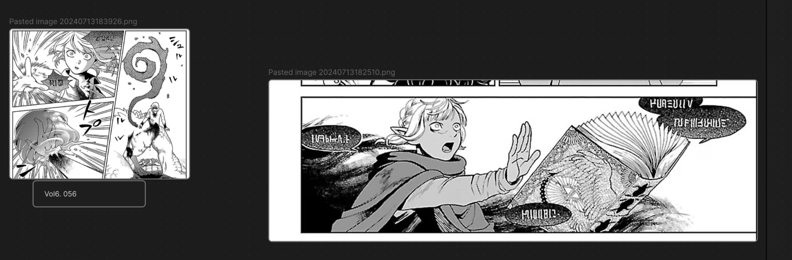

All magic spells/symbols appearing  in the manga version of Delicious in Dungeon.





Whether you want to learn dark magic, explosive magic, or healing magic, you can find it all here. 

If you're a fan of languages or symbology, you're also welcome to join us in deciphering this mysterious language.


## Quick Start：The Magical Journey Begins!

### Step 1: Summon the Repository
First things first, you need to download the repository. Don't worry, no incantations required!

1. **Open your terminal** (it's the muggle version of a wizard's wand).
2. Type the following spell... uh, command:
    ```bash
    git clone https://github.com/YourMagicalRepo/magic-course.git
    ```
3. Press `Enter` and watch the magic happen as the repository appears on your computer.

### Step 2: Unleash Obsidian's Power
Now that you have the repository, it's time to use your mystical tool: Obsidian.

1. **Open Obsidian** (if you don’t have it, you can download it [here](https://obsidian.md/)).
2. Once Obsidian is open, click on the **Open folder as vault** option.
3. Navigate to the location where you cloned the repository, select it, and hit **Open**.

### Step 3: Begin Your Magical Course
Congratulations, young wizard! You are now ready to start your magical course.

1. In Obsidian, explore the files and find the *magic_spells.md*  file. This is your portal to magical knowledge.
2. Open the file . Your journey into the magical arts begins now!

May your path be filled with wisdom and a touch of humor. Happy learning!
